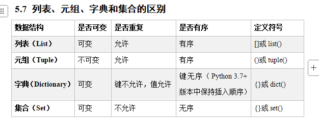

# Python 和 Java 关于 关键数据结构的差异

---
列表就是对应Java的List

元组 类似不可变的List(像数组)

字典就是 Map

集合Set 就是对应Set

# 第六章 函数

`print()` 就是一个system函数 类似于 java的`System.out.println()`
给控制台输出内容
## 6.1 函数的概念
函数就是类似 JAVA语言中的method方法
* 函数是带名字的代码块,用于完成具体任务,可重复使用
* 遵循先定义后使用的原则
* 除了自定义,还可以使用内建函数

```python
'''
       该案例演示了向控制台打印2*3的 "*"
'''
row = 2 #行号为2
while row > 0 : #行号
         print("*" * 3)
         row -= 1
 
#***
#***
```
如果想要重复使用上述代码，只能重复写
## 6.2 函数定义
### 6.2.1 语法

```python
#Python 定义函数使用 def 关键字，一般格式如下：
def 函数名 (参数列表) :
        函数体
        [return]
```
### 6.2.2 定义
* 函数块以 `def`关键字开头,后接函数标识符名称和`()`
* 传入参数和自变量必须传入`()`,`()`中也可以用于定义参数
* 函数的第一行语句可以选择性的使用文档字符串,用于存放函数说明
    >  ps: 类似JAVA的 /** 文档注释 python 用 """ || '''
* 函数参数后以冒号结束
* 函数体开始要缩进(这点和JAVA是截然不同的,JAVA也有缩进但是python的写法感觉像yaml)
* `return[表达式]` 来结束一个函数,选择性返回一个值给调用方。不带表达式的return 相当于返回None 
  > 这点和JAVA也不一样，Python不用定义return 不是void 而算是return none 挺奇特的
### 6.2.3 函数名
* 需要遵循标识符的命名规则
* 一般是一个动词，第一个单词小写，其他每个单词的首字母大写(驼峰命名)

### 6.2.4 参数
这个没什么好说的吧 刚刚上面都说过了...

### 6.2.5 函数体
调用函数时执行的代码，可包含函数说明文档与返回值。
> 函数体就是代码的主体

### 6.2.6 返回值 
有些函数在执行的时候，需要有返回值给调用该函数的以防，通过return关键字进行返回，返回结果到函数调用的位置。

## 6.3 函数的抽取以及调用
课件里说的就是`test01.py`已操作
就是想证明这个冗余了

* 函数必须**先定义再调用**
* 函数在定义的时候只是告诉解释器定义了一个这样的函数，可以完成某些功能，但是这个时候函数**还没有执行**，需要调用函数后，才会执行。

## 6.4 使用函数的好处
* 使程序变更简短清晰
* 提高程序开发效率
* 提高代码复用性
* 便于程序分工协作开发
* 便于代码的集中管理
* 便于程序维护
--- 
一些代码复用的废话

## 6.5函 数的参数
### 6.5.1参数的抽取
在上面的案例中，虽然我们抽取了函数去完成打印2x3的*功能。如果现在希望打印出如下图形，该如何实现?

```bash
***   
*** 
--------------
****
```
1.第一种方式：不封装函数
粘代码

2）第二种方式：封装函数
```python
'''
    该案例演示了封装函数
    向命令窗口打印输出
    ***
    ***
    --------
    ****
'''
def printStar1() :
    '''
        该函数可以打印2行3列的*
    '''
    row = 2
    while row > 0 :
        print("*" * 3)
        row -= 1

def printStar2() :
    '''
        该函数可以打印1行4列
    '''
    row = 1
    while row > 0 :
        print("*" * 4)
        row -= 1

# 调用函数
printStar1()
print("-" * 20)
printStar2()
```
拆分出来复用

> 注意：这里我们虽然封装了函数，但是printStar1和printStar2这两个函数中的大部分代码还是一样的，存在冗余。
  
printStar1和printStar2中不一样的地方:
* 函数体中row变量值和打印*的个数不一样。
> 这两个值分别可以理解代表打印*的行数以及打印的列数，既然我们现在的需求，打印的行和列是不固定的，所以我们只提供打印*的函数，具体要打印几行几列的*，让函数的调用者自己决定。这就要求我们在提供函数的时候，需要通过函数的参数接收行和列数据（函数的形式参数-形参）；在调用函数的时候需要把行和列数据作为参数传递过来（函数的实际参数-实参）。

```python

'''
wgy: 封装了一个通用函数
    该案例演示了封装带参数的函数
    向命令窗口打印输出
    ***
    ***
    --------
    ****
'''
def printStar(row,col) :
    while row > 0 :
        print("*" * col)
        row -= 1

printStar(2,3)
print("-" * 20)
printStar(1,4)
```

### 6.5.2 形参和实参
* 在定义函数时，指定的参数称为形式参数，简称为形参（函数的提供者）
* 在调用函数时，给函数传递的参数称为实际参数，简称为实参（函数的调用者）
* 在定义函数时，形参没有分配存储空间，也没有值，相当于一个占位符;
> 在调用函数时， 会在栈区中给函数分配存储空间， 然后给形参/局部变量分配存储空间，传递的是实际的数据
* 当函数执行结束，函数所占的栈空间会被释放，函数的形参/局部变量也会被释放
---
定义函数()里面的是形参
调用函数里传入的叫实参